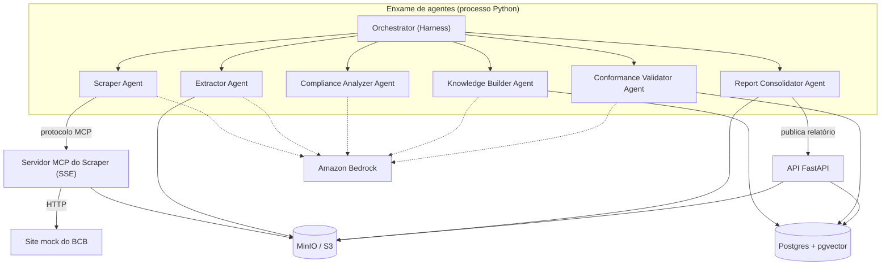
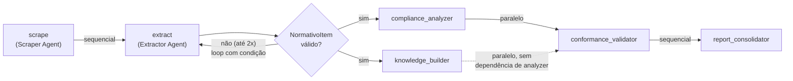
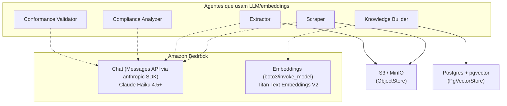

# PIX Compliance Swarm

Enxame de agentes Pydantic AI para compliance de normativos PIX fictícios do BCB.

## Visão geral

O PIX Compliance Swarm coleta normativos fictícios do BCB sobre o arranjo PIX, extrai regras
estruturadas de cada um, analisa conformidade contra a versão anterior de cada normativo, e
consolida um relatório de gaps — tudo orquestrado por um enxame de sete agentes Pydantic AI
(seis agentes especializados mais um "harness" de orquestração determinística), sem nenhuma
lógica de negócio duplicada entre eles.

O projeto nasceu como desafio técnico para a vaga de AI Engineer Sênior na Verity, com prazo
de 4 dias, e foi desenvolvido inteiramente via metodologia *spec-driven* (GitHub Spec Kit) —
cada uma das dezoito specs numeradas (`specs/001-*` a `specs/018-*`) define contrato, testes,
e critérios de aceite antes do código correspondente ser escrito (ver "Metodologia de
especificação" abaixo). O resultado é auditável ponta a ponta: toda decisão de arquitetura
não óbvia está documentada em prosa (nos `research.md` de cada spec, ou em
`docs/architecture.md`), não apenas implícita no código.

Os dados são inteiramente fictícios (BCB/PIX fictício para fins do desafio) — nenhuma
integração real com o Banco Central ou com o arranjo PIX de produção.

## Dependências e requisitos

- **Python 3.11+** (`requires-python` em `pyproject.toml`).
- **Docker + Docker Compose v2** — para `postgres` (com `pgvector`), `minio`, e, opcionalmente,
  o stack completo em container (SPEC-016).
- **Credenciais AWS com acesso ao Amazon Bedrock** — apenas para execução real
  (`LLM_PROVIDER=bedrock`, o caminho de produção); a suíte de testes roda inteiramente sem
  elas (`LLM_PROVIDER=offline`, SPEC-005/017).
- Bibliotecas Python principais (ver `pyproject.toml` para a lista completa e versões
  mínimas): `pydantic`/`pydantic-settings`, `pydantic-ai-slim[bedrock,mcp]`, `anthropic[bedrock]`,
  `fastapi`/`uvicorn`, `boto3`/`botocore`, `psycopg`/`pgvector`, `apscheduler`, `structlog`,
  `mcp` (SDK do Model Context Protocol), `pdfplumber`/`beautifulsoup4` (extração), `reportlab`
  (geração de PDF).

## Instalação e variáveis de ambiente

```bash
git clone https://github.com/gabrielmendesai/pix-compliance-swarm
cd pix-compliance-swarm
cp .env.example .env
# preencher .env: no mínimo AWS_ACCESS_KEY_ID/AWS_SECRET_ACCESS_KEY/AWS_REGION
# (para execução real via Bedrock) — .env.example documenta cada variável
# inline, com o valor padrão já correto para o stack local (Postgres/MinIO
# do docker-compose.yml)
make install
```

`make install` cria um virtualenv (`.venv/`) e instala o projeto em modo editável com as
dependências de desenvolvimento (`pip install -e ".[dev]"`).

Variáveis de ambiente obrigatórias (`Settings` falha com uma mensagem acionável se qualquer
uma faltar — nunca um traceback cru, FR-004 da SPEC-001) — resumo; `.env.example` documenta
cada uma com o racional completo:

| Variável | Propósito |
|---|---|
| `LLM_PROVIDER` | `bedrock` (produção) ou `offline` (só suíte de testes) |
| `AWS_ACCESS_KEY_ID`/`AWS_SECRET_ACCESS_KEY`/`AWS_REGION` | Credenciais AWS para o Bedrock |
| `BEDROCK_MODEL_ID`/`BEDROCK_EMBEDDINGS_MODEL_ID` | Modelos de chat/embeddings no Bedrock |
| `POSTGRES_DSN` | Conexão com o Postgres/pgvector |
| `OBJECT_STORAGE_ENDPOINT`/`OBJECT_STORAGE_ACCESS_KEY`/`OBJECT_STORAGE_SECRET_KEY`/`OBJECT_STORAGE_BUCKET` | Object storage (MinIO local ou S3 real) |
| `BCB_BASE_URL`/`MCP_SCRAPER_HOST`/`MCP_SCRAPER_PORT` | Site mock do BCB e servidor MCP do Scraper |
| `API_URL` | URL da própria API (usada pelo Report Consolidator como cliente HTTP) |

## Como executar

Com o Postgres/MinIO locais no ar (`make up`, ou os serviços equivalentes via
`docker compose up postgres minio -d`) e `.env` preenchido:

```bash
# Pipeline completo (scraping -> extração -> análise -> consolidação), ad-hoc:
make run

# Mesmo pipeline, agendado via APScheduler (cron em ORCHESTRATOR_SCHEDULE_CRON),
# como processo de longa duração (mesmo comando usado pelo container `scheduler`):
python -m pix_compliance.agents.orchestrator_agent --daemon

# API (rotas incluindo POST /runs, que dispara o mesmo run_pipeline via HTTP):
uvicorn pix_compliance.api.app:app --reload
# Swagger: http://localhost:8000/docs

# Suíte de testes completa (roda offline, sem credenciais AWS — SPEC-017):
make test
```

`make run` sobe, em processo, uma cópia efêmera do mock BCB e do servidor MCP do Scraper —
nenhum serviço adicional precisa estar rodando manualmente para uma execução completa de
ponta a ponta fora do Docker (só Postgres/MinIO).

## Como subir via Docker

```bash
cp .env.example .env   # preencher as credenciais AWS
docker compose up -d
docker compose ps      # todos os serviços devem ficar "healthy"
```

Sobe o stack inteiro (`postgres`, `minio`, `mock-bcb`, `bootstrap`, `mcp-scraper`, `api`,
`scheduler`) a partir de um repositório limpo, sem nenhum passo manual — incluindo a criação
do bucket e a aplicação da migration do `pgvector` (serviço `bootstrap`, SPEC-016). Detalhes
completos (multi-stage build, healthchecks, o script de verificação
`scripts/verify_containerization.sh`) na seção "Conteinerização" mais abaixo.

```bash
docker compose down -v && docker compose up -d   # reset completo, mesmo resultado
```

## Integração com servidores MCP

O Scraper Agent nunca acessa o site do BCB diretamente — toda coleta passa por um servidor
MCP dedicado (`mcp_servers/scraper_sse/`, transporte SSE, SPEC-007), que expõe três
ferramentas (`list_normativos`, `fetch_normativo`, `detect_changes`) sobre um `Fetcher`
genérico e um `Adapter` específico do site mock. O agente se conecta a esse servidor via
`MCPToolset` (Pydantic AI), nunca por import direto de função — o mesmo protocolo que um
cliente MCP real (ex. Claude Desktop) usaria.

- **Local (`make run`)**: o Orchestrator sobe sua própria cópia efêmera do servidor MCP em
  processo, em porta escolhida dinamicamente pelo sistema operacional (SPEC-017 — evita
  conflito de porta entre execuções).
- **Docker (`docker compose up -d`)**: o servidor MCP roda como o serviço `mcp-scraper`,
  container próprio, porta `8100` publicada no host (SPEC-016).
- **Conectar um cliente MCP externo**: `mcp_servers/scraper_sse/server.py` expõe transporte
  SSE padrão — qualquer cliente MCP compatível (não só o Scraper Agent) pode se conectar em
  `http://<host>:<porta>/sse` e listar/chamar as três ferramentas.

## Desenvolvimento e ferramentas

Seção de transparência (item 11 do desafio original) — como este projeto foi de fato
desenvolvido, sem narrativa idealizada.

### Forma de desenvolvimento adotada

Desenvolvimento assistido por IA (Claude Code) com revisão humana em cada etapa — não geração
autônoma sem supervisão. O fluxo seguido para cada uma das dezoito specs foi: `/speckit-specify`
(spec.md, revisado antes de prosseguir) → `/speckit-plan` (research.md/data-model.md/contracts/,
com "Constitution Check" contra os 9 princípios) → `/speckit-tasks` (tasks.md, tarefas de teste
antes das de implementação) → `/speckit-implement` (execução tarefa a tarefa, com testes
confirmados falhos antes do código correspondente existir — Princípio IX). Dois desvios reais
dessa ordem aconteceram (SPEC-011, implementada fora de ordem; SPEC-017, ordem parcialmente
invertida por ser uma feature sobre os próprios testes) — detalhados em
[`docs/spec-methodology.md`](docs/spec-methodology.md), não escondidos.

A auditoria de gaps da SPEC-017 é o exemplo mais concreto de "revisão humana no loop": em vez
de assumir que a suíte estava completa porque cada spec teve seus próprios testes, essa spec
rodou a suíte inteira, auditou cobertura de `models.py`/`guardrails.py`, e encontrou (e
corrigiu) um bug real de PII (e-mail de um caractere detectado mas não mascarado) que nenhum
teste anterior havia coberto.

### Skills e recursos consultados

- Documentação oficial do [Pydantic AI](https://ai.pydantic.dev/) (agentes, `RunContext`,
  `MCPToolset`, `TestModel`/`FunctionModel` para testes determinísticos).
- Documentação da [Messages API da Anthropic via Amazon Bedrock](https://docs.anthropic.com/)
  (superfície usada por `BedrockChatProvider`, `src/pix_compliance/llm_provider.py`).
- Especificação do [Model Context Protocol](https://modelcontextprotocol.io/) (SDK `mcp`,
  transporte SSE).
- [GitHub Spec Kit](https://github.com/github/spec-kit) — metodologia spec-driven usada em
  todo o projeto (ver "Metodologia de especificação" abaixo).
- As sete `skills/*-skill/SKILL.md` deste próprio repositório — cada uma documentando o
  contrato do agente correspondente, consultadas pelo Claude Code durante a implementação de
  cada spec subsequente que dependia daquele agente.

### Métodos de orquestração no enxame

| Padrão | Onde aparece | O quê |
|---|---|---|
| **Sequencial** | `orchestrator_agent.py::_executar_etapas` — `scrape → extract` | O Extractor depende do documento já coletado pelo Scraper; não há como estruturar um `NormativoItem` sem o texto bruto baixado. |
| **Paralelo** | `orchestrator_agent.py::_executar_etapas` — `compliance_analyzer ‖ knowledge_builder` (via `asyncio.gather`) | Ambos partem do mesmo `NormativoItem` já extraído, sem depender um do resultado do outro — categorizar regras e indexar embeddings são leituras independentes do mesmo dado. |
| **Loop com condição** | `extractor_agent.py` — loop de reparo de validação (linhas ~173–210) | Até 2 tentativas de estruturar um `NormativoItem` válido a partir do texto bruto — se a 1ª falhar a validação Pydantic, a 2ª tentativa recebe o erro explícito como contexto adicional; nunca uma 3ª tentativa. |
| **Delegação agente-para-agente via ferramenta** | `scraper_agent.py` → servidor MCP (`mcp_servers/scraper_sse/`) | O Scraper Agent delega a coleta a um servidor MCP separado via chamada de ferramenta real (protocolo MCP), não por import direto de função. |

### Diferenciais explorados

- **Amazon Bedrock** como único provider LLM de produção (Princípio I da constituição) — duas
  superfícies de integração distintas usadas deliberadamente (Messages API via SDK `anthropic`
  para chat com modelos recentes; `boto3`/`invoke_model` para embeddings Titan, que não têm
  equivalente na Messages API) — ver seção "Provider LLM e embeddings via Amazon Bedrock" mais
  abaixo.
- **`pgvector` sobre PostgreSQL** em vez de um serviço gerenciado de busca vetorial dedicado —
  decisão de arquitetura documentada e justificada em [`docs/architecture.md`](docs/architecture.md)
  (ADR-01).
- **Conteinerização com bootstrap idempotente** (SPEC-016) — `docker compose up -d` a partir
  de um repositório limpo, sem nenhum passo manual (criação de bucket, aplicação de migration),
  mesmo em resets completos (`down -v && up -d`).
- **Constituição do projeto** (`.specify/memory/constitution.md`, 9 princípios) como mecanismo
  de governança ativo, não decorativo — cada plano de implementação passa por um "Constitution
  Check" explícito antes e depois do design.

## Arquitetura

Três diagramas Mermaid (renderizam nativamente na página do GitHub, sem ferramenta externa),
cada um respondendo a uma pergunta específica: o que existe (container), como o enxame
processa uma execução (componente), e como cada peça fala com a AWS (integrações).

### Visão de container (C4)



### Componente do enxame — pipeline do Orchestrator

Os três padrões de orquestração avaliados pelo desafio, anotados diretamente no fluxo (ver
também "Métodos de orquestração no enxame", na seção "Desenvolvimento e ferramentas"):



### Integrações AWS



## Skills do enxame

Um `SKILL.md` por agente (formato uniforme: Responsabilidade, Ferramentas, Input, Output —
estabelecido por `scraper-skill` e seguido pelos seis seguintes, padrão similar ao workspace
ADK citado pelo desafio original):

| Agente | Skill | Spec |
|---|---|---|
| Scraper Agent | [`skills/scraper-skill/SKILL.md`](skills/scraper-skill/SKILL.md) | SPEC-008 |
| Extractor Agent | [`skills/extractor-skill/SKILL.md`](skills/extractor-skill/SKILL.md) | SPEC-009 |
| Compliance Analyzer Agent | [`skills/compliance-analyzer-skill/SKILL.md`](skills/compliance-analyzer-skill/SKILL.md) | SPEC-010 |
| Conformance Validator Agent | [`skills/conformance-validator-skill/SKILL.md`](skills/conformance-validator-skill/SKILL.md) | SPEC-011 |
| Knowledge Builder Agent | [`skills/knowledge-builder-skill/SKILL.md`](skills/knowledge-builder-skill/SKILL.md) | SPEC-012 |
| Report Consolidator Agent | [`skills/report-consolidator-skill/SKILL.md`](skills/report-consolidator-skill/SKILL.md) | SPEC-014 |
| Orchestrator (Harness) | [`skills/orchestrator-skill/SKILL.md`](skills/orchestrator-skill/SKILL.md) | SPEC-015 |

## Metodologia de especificação

Todo o projeto foi desenvolvido via *spec-driven development* usando o
[GitHub Spec Kit](https://github.com/github/spec-kit) — dezoito specs numeradas
(`specs/001-*` a `specs/018-*`), cada uma com `spec.md`/`plan.md`/`research.md`/`tasks.md`
próprios, seguindo um fluxo fixo de comandos (`/speckit-specify` → `/speckit-plan` →
`/speckit-tasks` → `/speckit-implement`) e governadas por nove princípios registrados em
[`.specify/memory/constitution.md`](.specify/memory/constitution.md). Detalhes completos —
por que escopo negativo explícito, o papel do `constitution.md`/`CLAUDE.md`, e os dois
desvios reais do Princípio IX que aconteceram de fato — em
[`docs/spec-methodology.md`](docs/spec-methodology.md).

## Mapeamento dos 11 entregáveis do desafio original

Tabela de rastreabilidade direta — cada entregável exigido pela seção 5 do desafio original
apontando para onde ele está neste repositório. Itens 7–11 são o objeto desta seção de
documentação (SPEC-018); os demais já existiam antes dela e são só referenciados aqui.

| # | Entregável | Onde está |
|---|---|---|
| 1 | Código-fonte (boas práticas Git, agente Pydantic AI, modelos, MCP, API FastAPI, Docker/compose, guardrail) | `src/pix_compliance/`, `mcp_servers/`, `Dockerfile`, `docker-compose.yml`, histórico de commits |
| 2 | Modelos Pydantic de exemplo (`NormativoItem`, `ConformanceReport`, modelos da API) | `src/pix_compliance/models.py`; `docs/schemas/*.schema.json` |
| 3 | Fixture com ≥50 normativos fictícios | `fixtures/normativos.json` (53 itens) |
| 4 | ≥3 documentos PDF/HTML mock | `fixtures/documents/` (4 normativos, PDF + HTML cada) |
| 5 | Evidência de funcionamento (logs, screenshots, vídeo) | `docs/evidence/pipeline-run.log` (logs); screenshots/vídeo — ver `docs/evidence/README.md` |
| 6 | Evidência da API (`/docs`, exemplos de request/response) | `src/pix_compliance/api/routes.py` (todo endpoint documentado com exemplo, `tests/test_api.py::test_openapi_schema_tem_descricao_e_exemplo_em_toda_rota`); screenshot do Swagger — ver `docs/evidence/README.md` |
| 7 | Diagrama de arquitetura (Mermaid, C4) | Seção "Arquitetura" abaixo — 3 diagramas (container, componente do enxame, integrações AWS) |
| 8 | `SKILL.md` por agente especializado | Seção "Skills do enxame" abaixo; arquivos em `skills/*/SKILL.md` (7 agentes) |
| 9 | Plano de especificação (metodologia spec-driven) | Seção "Metodologia de especificação" abaixo; [`docs/spec-methodology.md`](docs/spec-methodology.md) |
| 10 | README da solução | Este arquivo |
| 11 | Seção de transparência "Desenvolvimento e ferramentas" | Seção "Desenvolvimento e ferramentas" abaixo |

## Fixtures: `documents/` vs `normativos.json`

O projeto mantém dois corpora de fixture com propósitos deliberadamente
diferentes, não redundantes entre si:

- **`fixtures/documents/` (3+ PDF/HTML)** é a prova de conceito da extração:
  demonstra que o par Scraper → Extractor funciona de ponta a ponta a partir
  de um documento bruto real (um documento denso multi-artigo/multi-categoria,
  um documento com PII plantada, e um par de versões com delta conhecido).
  Não precisa de volume — precisa de estrutura e conteúdo realistas o
  suficiente para segmentação em artigo/inciso.
- **`fixtures/normativos.json` (50+ registros)** representa o corpus já
  extraído e estruturado, usado para exercitar as features que dependem de
  volume — Compliance Analyzer, Conformance Validator, Knowledge
  Builder/RAG e a API. É a base de dados real do sistema. Os PDFs de
  `fixtures/documents/` não são reprocessados em massa por decisão consciente
  de escopo: gerar e parsear 50 documentos reais não agregaria sinal de
  engenharia proporcional ao tempo que custaria.

O scraping (SPEC-007/008) é feito contra o site mock estático em
`mock_bcb/`, nunca contra o `bcb.gov.br` real — decisão já registrada em
ADR-04 (`Initial Design/BRIEFING.md`), reafirmada aqui para não parecer
inconsistência para quem avaliar o projeto.

## Guardrail de PII (`src/pix_compliance/guardrails.py`)

`guard()` é o único caminho permitido para texto destinado a um LLM ou a uma
escrita de storage: detecta CPF, CNPJ, e-mail, telefone e chave PIX
aleatória, e mascara cada ocorrência preservando o formato original (ex.
`123.***.***-01`), em vez de um marcador genérico.

O detalhe que diferencia esta implementação de um regex ingênuo é a
**validação real do dígito verificador de CPF/CNPJ** (módulo 11), não
apenas checagem de formato. Um regex sozinho trataria qualquer sequência de
11 dígitos como um possível CPF; validar o dígito verificador elimina a
esmagadora maioria desses falsos positivos e é barato de implementar (menos
de 15 linhas por documento) — não há motivo para não fazê-lo.

## Provider LLM e embeddings via Amazon Bedrock (`src/pix_compliance/llm_provider.py`)

`LLM_PROVIDER=bedrock` é o único caminho de produção (Princípio I da
constituição): sem credencial válida ou sem acesso ao modelo liberado, a
aplicação recusa subir com uma mensagem acionável — nunca degrada
silenciosamente para outro provider. `LLM_PROVIDER=offline` existe
exclusivamente para a suíte de testes (`OfflineProvider`, isolado em
`tests/doubles/`, nunca importável de dentro de `src/`).

### Configuração de acesso AWS necessária

1. **Usuário IAM com acesso programático**, com a policy gerenciada
   `AmazonBedrockFullAccess` anexada (ou uma policy mais restrita
   equivalente, por exemplo permitindo apenas `bedrock:InvokeModel` e
   `bedrock:InvokeModelWithResponseStream` nos ARNs dos modelos usados por
   este projeto). Gere um `AWS_ACCESS_KEY_ID`/`AWS_SECRET_ACCESS_KEY` para
   esse usuário e preencha `.env` (nunca versionar essas credenciais).
2. **Passo de "primeiro uso" (First Time Use) para modelos Anthropic**: no
   console AWS, abra o Bedrock → *Model access* → *Model catalog*, selecione
   o modelo Claude desejado e preencha o formulário de caso de uso no
   playground **uma única vez por conta** — a liberação é imediata (não há
   mais espera de aprovação manual por horas). Sem esse passo, toda
   invocação ao modelo falha com `AccessDeniedException`, que este projeto
   converte na mesma mensagem acionável usada para credencial ausente (ver
   `BedrockAccessDeniedError`/`BedrockCredentialsError` em
   `llm_provider.py`).
3. A autenticação é sempre via credenciais IAM da AWS — não existe uma
   "chave de API do Claude" separada nesse fluxo, diferente da API direta da
   Anthropic.

### Cadeia de fallback

`BEDROCK_FALLBACK_MODEL_IDS` (`.env.example`) aceita uma lista de `model_id`
adicionais, no mesmo formato de `BEDROCK_MODEL_ID`, separados por vírgula,
tentados em ordem com backoff exponencial caso o modelo primário falhe
(throttling, indisponibilidade momentânea). Erros de limite de taxa e de
requisição inválida acionam a tentativa do próximo modelo da cadeia; acesso
negado e credencial inválida falham alto imediatamente, sem tentar outro
modelo (não são transientes).

### Nota de arquitetura: duas superfícies de integração do Bedrock

O Bedrock hoje expõe **duas superfícies de integração distintas** para
modelos Anthropic, e este projeto usa a segunda de propósito, não por
descuido:

- **Legada** — API `InvokeModel`/`Converse`, acessada via `boto3.client
  ("bedrock-runtime")`. Documentada pela Anthropic como o caminho para
  **Claude Opus 4.6 e modelos anteriores**. Formato de `model_id`
  ARN-versionado (ex. `anthropic.claude-3-sonnet-20240229-v1:0`).
- **Atual** — Messages API em `/anthropic/v1/messages`, acessada via
  `AnthropicBedrock` do pacote `anthropic` (instalado com o extra
  `[bedrock]`). É a **única** superfície que serve os modelos Anthropic mais
  recentes, incluindo o **Claude Haiku 4.5** escolhido para este projeto. O
  formato de `model_id` aqui depende da disponibilidade do modelo na
  conta/região: pode ser um ID direto (`anthropic.claude-haiku-4-5`) ou,
  como neste projeto, um **inference profile de cross-region** (prefixo de
  grupo de região + sufixo de data/versão, ex.
  `us.anthropic.claude-haiku-4-5-20251001-v1:0`) — verificado em setup manual
  no console, quando o ID direto não estava disponível para invocação nessa
  conta. O que diferencia esta superfície da legada não é o formato do
  `model_id`, e sim o transporte (`AnthropicBedrock`/Messages API vs.
  `boto3`/Converse).

`BedrockChatProvider` (`src/pix_compliance/llm_provider.py`) usa a superfície
atual (`AnthropicBedrock`/Messages API) — não por preferência estética, mas
porque é a única que funciona com o modelo escolhido. Um efeito colateral
favorável: o formato de mensagens da Messages API (`{"role": ..., "content":
...}`) é o mesmo usado nativamente pelo Pydantic AI e por agentes que
conversam com modelos Anthropic fora do Bedrock, o que simplifica a
integração em vez de complicá-la. A autenticação continua idêntica nas duas
superfícies — sempre via `AWS_ACCESS_KEY_ID`/`AWS_SECRET_ACCESS_KEY`/
`AWS_REGION`, resolvidos explicitamente a partir de `Settings`, nunca por
uma "chave de API do Claude" separada.

Embeddings Titan não têm equivalente no SDK `anthropic` —
`BedrockEmbeddingsProvider` continua na superfície legada
(`boto3`/`invoke_model`), que é a única forma de invocar Titan.

## Camada de armazenamento (`src/pix_compliance/object_store.py`, `src/pix_compliance/vector_store.py`)

`ObjectStore` (`Protocol`, implementado por `S3ObjectStore`) persiste
artefatos binários via `boto3`/S3 — a mesma classe serve MinIO local (padrão
de desenvolvimento) e S3 real trocando apenas `OBJECT_STORAGE_ENDPOINT`.
`PgVectorStore` (classe concreta, sem `Protocol` — única implementação de
vector store deste projeto, ver ADR-01 em `docs/architecture.md`) persiste
vetores de embedding (dimensão 512, travada em `EMBEDDING_DIMENSION` em
`config.py`, herdada da SPEC-005) sobre PostgreSQL/`pgvector`.

### Subir o ambiente local

```bash
docker compose up postgres minio -d
```

Depois de os serviços subirem, aplique a migration que cria o schema do
vector store (idempotente — usa `IF NOT EXISTS`):

```bash
docker compose exec -T postgres psql -U pix -d pix_compliance -f - < migrations/0001_create_vector_store_schema.sql
```

Rodar a suíte de armazenamento contra os serviços reais (sem mock, conforme
Princípio VIII da constituição):

```bash
pytest tests/test_object_store.py tests/test_vector_store.py tests/test_no_orphan_abstractions.py -q
```

## Scraper Agent (`src/pix_compliance/agents/scraper_agent.py`)

Primeiro agente Pydantic AI do enxame (SPEC-008) — estabelece o padrão
estrutural (`deps_type`, `RunContext`, `output_type`, tratamento de erro de
dependência externa) que os seis agentes seguintes reutilizam. Decide o quê
coletar (`list_normativos`/`detect_changes`) e coleta (`fetch_normativo`)
inteiramente através do toolset MCP do servidor da SPEC-007 — nunca por
import direto de função —, sem nenhuma lógica de parsing de HTML ou
extração de campos (Princípio IV), e devolve um `ScrapeResult` validado.

Uma falha de conexão com o servidor MCP aciona uma política de retry com
backoff própria (`tenacity`), deliberadamente independente da cadeia de
fallback de `model_id` do Bedrock (SPEC-005) — ao esgotar as tentativas,
levanta `ScraperTransportError`, nunca a exceção crua do cliente MCP. Ver
`skills/scraper-skill/SKILL.md` para o formato de documentação replicado
pelos agentes seguintes.

```bash
python -m pix_compliance.agents.scraper_agent
pytest tests/test_scraper_agent.py -q
```

## Extractor Agent (`src/pix_compliance/agents/extractor_agent.py`)

Segundo agente do enxame (SPEC-009), reaproveitando o mesmo padrão
estrutural do Scraper Agent. Converte um documento bruto (PDF/HTML,
referenciado por chave no `ObjectStore`) em `NormativoItem` validado, em
dois passos: extração de texto **determinística** (`pdfplumber` para PDF,
`BeautifulSoup` para HTML — nunca delegada ao LLM), seguida de `guard()`
(SPEC-004) sobre o texto extraído e só então estruturação via LLM apenas dos
campos ambíguos que a extração não resolveu sozinha. `url_origem`/
`hash_conteudo` nunca são pedidos ao LLM — um SHA-256 real não é algo que um
modelo de linguagem consiga computar, só alucinar em formato válido; ambos
são copiados diretamente do `RawDocument` de entrada, já calculados de
verdade pelo Scraper Agent (SPEC-007/008).

Um loop de reparo de validação, escrito explicitamente (não o retry
automático do Pydantic AI) e instrumentado com log estruturado por
tentativa, tenta no máximo duas vezes: se a primeira estruturação falhar na
validação Pydantic, a segunda tentativa recebe a mensagem de erro específica
do Pydantic — nunca uma terceira tentativa. PDF corrompido/malformado gera
`PdfExtractionError`, nunca a exceção crua de `pdfplumber`. Ver
`skills/extractor-skill/SKILL.md`.

```bash
python -m pix_compliance.agents.extractor_agent <object_store_key> <content_type> <source_uri>
pytest tests/test_extractor_agent.py -q
```

## Compliance Analyzer Agent (`src/pix_compliance/agents/compliance_analyzer_agent.py`)

Terceiro agente do enxame (SPEC-010), reaproveitando o mesmo padrão
estrutural das SPEC-008/009. Categoriza as regras de compliance de um
`NormativoItem` nas seis dimensões do desafio original (participantes,
tarifas, liquidação, segurança, SLA, interoperabilidade), com um system
prompt que define operacionalmente cada categoria para reduzir ambiguidade
entre pares próximos (ex. participantes vs. interoperabilidade).

Processa lotes concorrentemente, com um `asyncio.Semaphore` limitando o
número de chamadas simultâneas ao LLM a
`COMPLIANCE_ANALYZER_MAX_CONCURRENCY` (custo e rate limit do Bedrock, não só
performance). Cada `RegraExtraida` tem `revisao_humana_necessaria`
recalculado deterministicamente (nunca confiado ao LLM) quando `confianca`
cai abaixo de `COMPLIANCE_ANALYZER_CONFIDENCE_THRESHOLD`. `guard()`
(SPEC-004) é reaplicado sobre o texto de entrada antes de qualquer chamada
ao LLM — redundância deliberada, mesmo com entrada supostamente já limpa
vinda do Extractor Agent. Ver `skills/compliance-analyzer-skill/SKILL.md`.

```bash
python -m pix_compliance.agents.compliance_analyzer_agent fixtures/normativos.json
pytest tests/test_compliance_analyzer_agent.py -q
```

## Conformance Validator Agent (`src/pix_compliance/agents/conformance_validator_agent.py`)

Produz o gap analysis (SPEC-011): compara semanticamente as `RegraExtraida`
(SPEC-010) da versão atual e da versão imediatamente anterior do mesmo
normativo, classificando cada regra em `novo`, `alterado`, `revogado` ou
`conforme` (`StatusConformidade`, SPEC-002). A comparação é feita por
julgamento do LLM — não por diff textual bruto nem por similaridade de
embeddings — porque reconhecer que "prazo de 90 dias" virou "prazo de 180
dias" é uma alteração de significado, o tipo de julgamento que um LLM
estruturado resolve de forma confiável e um diff de string ou um limiar
numérico não. Quando um normativo não tem versão anterior, suas regras são
`novo`, resolvido inteiramente em código, sem nenhuma chamada ao LLM. `guard()`
(SPEC-004) é reaplicado sobre cada `enunciado` antes de qualquer chamada ao
LLM, mesmo padrão de defesa em profundidade do Compliance Analyzer. Ver
`skills/conformance-validator-skill/SKILL.md`.

**Nota de implementação fora de ordem**: esta é a SPEC-011 do catálogo do
projeto — deveria ter sido implementada antes da SPEC-012 (Knowledge
Builder) e da SPEC-014 (Report Consolidator), mas foi pulada por engano e
implementada depois, fora de ordem. **Pendência registrada**:
`report_consolidator_agent.py` (SPEC-014) foi implementado antes desta
feature existir e ainda não consome o `ConformanceReport` real produzido
aqui — essa revisão fica para uma spec/tarefa futura própria.

```bash
python -m pix_compliance.agents.conformance_validator_agent fixtures/normativos.json
pytest tests/test_conformance.py -q
```

## Knowledge Builder Agent (`src/pix_compliance/agents/knowledge_builder_agent.py`)

Indexa `NormativoItem` no `PgVectorStore` (SPEC-006) e serve busca semântica
(RAG) via `search(SearchQuery) -> list[SearchResult]`. Diferente dos demais
agentes do enxame (SPEC-008/009/010), não instancia `pydantic_ai.Agent` — não
há decisão de LLM aqui, apenas geração determinística de embeddings (Titan
V2, SPEC-005) e operações de storage.

Cada `NormativoItem` é indexado como exatamente um chunk — não há
subdivisão de `.texto` por uma janela fixa de caracteres/tokens. Essa é uma
decisão de domínio, não uma escolha técnica arbitrária: normativos
regulatórios são estruturados por natureza (artigo e inciso já são as
unidades de sentido do próprio texto legal, e já existem como campos de
`NormativoItem` desde a SPEC-002/SPEC-003). Ignorar essa estrutura em favor
de uma janela fixa de tokens destruiria precisão de recuperação sem
necessidade real — "chunking consciente de estrutura", aqui, significa
apenas respeitar a granularidade já nativa do corpus produzido pelo
Extractor Agent.

O `chunk_id` de cada chunk é um hash determinístico de `normativo_id` +
`artigo` + `inciso`, usado como chave de upsert no `PgVectorStore` —
reindexar o mesmo corpus substitui (nunca duplica) os chunks
correspondentes. `search()` reaproveita `SearchQuery`/`SearchResult`
(SPEC-002) sem alteração, com suporte a filtro por metadados (ex.
`categoria`) via `SearchQuery.filtros`.

Reranking e busca híbrida (léxica + semântica) ficam fora de escopo desta
feature. Busca híbrida é uma evolução futura possível — combinaria a busca
semântica atual com um índice léxico (full-text search do próprio Postgres,
por exemplo) para consultas onde correspondência exata de termo importa mais
que similaridade semântica —, mas implementá-la agora seria especulação sem
necessidade concreta (Princípio II, YAGNI). Ver
`skills/knowledge-builder-skill/SKILL.md`.

```bash
python -m pix_compliance.agents.knowledge_builder_agent fixtures/normativos.json
pytest tests/test_knowledge_builder_agent.py -q
```

## Report Consolidator Agent (`src/pix_compliance/agents/report_consolidator_agent.py`)

**Este é o agente que cumpre, de forma literal e verificável, o requisito
nominal da seção 2 do desafio técnico original: "invocar uma API FastAPI
como cliente HTTP para ação final".** A função `publish_to_api` é o cliente
HTTP que faz essa chamada, usando exclusivamente `settings.api_url` como
fonte da URL — nunca um literal no código-fonte deste agente.

Consolida o resultado do pipeline em dois artefatos: um JSON no formato
`ReportOutput` (SPEC-002) e um PDF via `reportlab`, com cinco seções (capa,
sumário executivo, tabela de normativos coletados, regras agrupadas por
categoria, gap analysis com severidade). Ambos são enviados ao `ObjectStore`
(SPEC-006) antes de qualquer tentativa de publicação HTTP — a persistência
local e no `ObjectStore` nunca depende do sucesso da chamada de rede.

Quando a API está indisponível (erro de conexão), o agente aplica
**degradação controlada**: os artefatos já gerados permanecem persistidos, e
o erro é logado de forma clara via `structlog` — o trabalho de geração do
relatório nunca é perdido só porque a publicação HTTP falhou. Apenas falhas
de transporte (`httpx.TransportError`) acionam essa degradação; erros de
aplicação retornados pela própria API (HTTP 4xx/5xx) propagam normalmente,
por indicarem um bug real de integração, não indisponibilidade transitória.

Diferente dos demais agentes do enxame (SPEC-008/009/010), não instancia
`pydantic_ai.Agent` — mesma situação do Knowledge Builder (SPEC-012): não há
decisão de LLM aqui, apenas consolidação determinística de dados e I/O.
Este agente foi implementado (SPEC-014) antes de SPEC-011 (Conformance
Validator) e SPEC-013 (API FastAPI) existirem como código, testado contra
os contratos já congelados (`ConformanceReport`/`ReportOutput`, SPEC-002) e
um cliente HTTP mock (`httpx.MockTransport`) — hoje, com `POST /runs`
delegando inteiramente a `run_pipeline` (SPEC-015), este agente recebe o
`ConformanceReport` real produzido pelo Conformance Validator dentro dessa
mesma execução, não mais um objeto construído manualmente pelo chamador.
Ver `skills/report-consolidator-skill/SKILL.md`.

```bash
python -m pix_compliance.agents.report_consolidator_agent
pytest tests/test_report_consolidator_agent.py -q
```

## API FastAPI (`src/pix_compliance/api/`)

Serviço HTTP documentado (SPEC-013), expondo os endpoints nominalmente
exigidos pelo desafio original, com Swagger completo em `/docs`. Vive em
`src/pix_compliance/api/`, deliberadamente fora de `agents/` — não é um
agente do enxame Pydantic AI, é a camada de transporte HTTP que expõe os
agentes já existentes.

| Rota | Descrição |
|---|---|
| `GET /normativos` | Lista normativos coletados, paginada, com filtros por `tipo`/`categoria`/período |
| `GET /compliance` | Gap analysis já produzido, com filtro por `severidade_min` |
| `GET /search?query=...&top_k=...` | Busca semântica via Knowledge Builder Agent (SPEC-012) |
| `GET /health` | Conectividade com `ObjectStore`/`PgVectorStore` — nunca retorna 500 por dependência indisponível, reporta `"degraded"` |
| `POST /runs` | Delega inteiramente a `run_pipeline` (SPEC-015), o mesmo handler do CLI/scheduler: Scraper → Extractor → [Compliance Analyzer ‖ Knowledge Builder] → Conformance Validator → Report Consolidator, retornando `PipelineResult` já completo |
| `POST /reports` | Recebe/reconhece o `ReportOutput` publicado pelo Report Consolidator Agent (SPEC-014) — adicionada durante a revisão de integração entre as duas specs, ver nota abaixo |

**Nota de integração**: `POST /reports` foi adicionada após a implementação
inicial desta spec, quando a revisão de integração com o Report
Consolidator Agent (SPEC-014) constatou que `publish_to_api` sempre apontou
para esse endpoint, mas ele nunca havia sido implementado (a lista original
de rotas desta spec não o incluía). É o endpoint real de recebimento do
relatório final consolidado — fecha, de fato, o requisito literal do
desafio original de "invocar uma API FastAPI como cliente HTTP para ação
final" (ver `specs/013-api-fastapi/spec.md`, Adendo, e
`specs/013-api-fastapi/contracts/api.md`).

Todo `response_model` reaproveita um modelo já definido na SPEC-002 —
nenhum schema de resposta duplicado. Toda falha (validação, recurso não
encontrado, erro interno) retorna um corpo `ErrorResponse` estruturado
(`correlation_id`, reaproveitando `pix_compliance.logging.
bind_run_correlation_id`, SPEC-001), nunca o corpo cru default do FastAPI.
Metadados de OpenAPI (título, descrição, versão, tags) e a descrição/
exemplo de cada rota estão completamente preenchidos — o desafio original
pede screenshot do Swagger como evidência formal de entrega, e um `/docs`
com placeholder genérico não cumpre esse requisito.

**Autenticação está conscientemente fora do escopo desta versão** — decisão
deliberada, não uma lacuna esquecida: um desafio técnico de prazo curto,
com um único operador/avaliador, não justifica a complexidade de um esquema
de autenticação completo (sessão, OAuth2, API key) sem um requisito de
negócio real por trás. Se este serviço evoluir para um ambiente
multiusuário, autenticação (provavelmente API key por cliente, dado o
perfil de consumidores HTTP-a-HTTP deste enxame) seria o próximo passo
natural.

`POST /runs` executa sincronamente (não enfileira um job em background):
`PipelineResult` (SPEC-002, já congelado) exige `sucesso`/`concluido_em`
preenchidos, sem um estado "pendente" representável — introduzir uma fila
de jobs (Celery/RQ) só para viabilizar um fluxo assíncrono seria
infraestrutura nova sem necessidade real para o volume deste projeto. A
rota delega inteiramente a `run_pipeline` (SPEC-015) e por isso aciona, de
verdade, o Scraper Agent via MCP (SPEC-007/008) sobre o mock do BCB — nunca
uma segunda implementação simplificada que pulasse Scraper/Extractor. Em
execução local (`uvicorn ... --reload`), o processo da API sobe sua própria
cópia efêmera do mock BCB e do servidor MCP (mesmo padrão do `make run`);
via `docker compose`, `ORCHESTRATOR_BOOTSTRAP_LOCAL_SERVERS=false` faz a
rota reaproveitar os containers `mock-bcb`/`mcp-scraper` já no ar, mesma
lógica condicional já estabelecida para o container `scheduler` (SPEC-016).

```bash
uvicorn pix_compliance.api.app:app --reload
# Swagger: http://localhost:8000/docs
pytest tests/test_api.py -q
```

## Orchestrator Agent e agendamento (`src/pix_compliance/agents/orchestrator_agent.py`)

Coordena os seis agentes já implementados de ponta a ponta (SPEC-015):

```
scrape -> extract -> [ compliance_analyzer || knowledge_builder ] -> conformance_validator -> report_consolidator
```

Três padrões de orquestração, cada um escolhido por uma razão real, não
"porque sim": `scrape`→`extract` é **sequencial** porque o Extractor
depende do documento já coletado; `compliance_analyzer`/`knowledge_builder`
rodam em **paralelo** (`asyncio.gather`) porque partem do mesmo
`NormativoItem` já extraído sem depender um do resultado do outro; o
**loop com condição** já existente no Extractor (SPEC-009, reparo de
validação) é reaproveitado dentro do fluxo maior, não reimplementado. A
"delegação agente-para-agente via chamada de ferramenta" já existe de
verdade: o Scraper Agent delega, via uma chamada MCP real, ao servidor MCP
separado (SPEC-007/008) — este módulo não introduz um segundo mecanismo de
tool-calling.

Cada etapa tem uma política de falha — **fatal** (aborta o pipeline
inteiro), **degradável** (loga e segue, ex. falha ao publicar o relatório
final via HTTP, comportamento já estabelecido na SPEC-014) ou **ignorável**
— e `PipelineResult` (SPEC-002) ganha uma extensão aditiva,
`etapas: list[EtapaMetric]`, com status e duração de cada etapa executada.
Um `correlation_id` único (SPEC-001) amarra todos os logs de uma mesma
execução, do início ao fim.

`make run` sobe, em processo, uma cópia do mock BCB e o servidor MCP do
Scraper (mesmo padrão já usado nos testes) antes de coletar — nenhum
serviço adicional precisa estar rodando manualmente para uma execução
completa de ponta a ponta. Um lock em processo (`asyncio.Lock`) impede duas
execuções sobrepostas; o mesmo handler (`run_pipeline`) é chamado tanto
pelo CLI quanto por um `APScheduler` (`ORCHESTRATOR_SCHEDULE_CRON`), nunca
dois caminhos de entrada divergentes. O caminho de produção do agendamento
(EventBridge) fica documentado como IaC em `docs/aws/eventbridge-schedule.tf`,
sem deploy real (fora de escopo).

`POST /runs` (SPEC-013, `src/pix_compliance/api/routes.py`) delega
inteiramente a `run_pipeline` — mesmo handler do CLI e do scheduler, nunca
uma segunda implementação do mesmo fluxo.

```bash
make run
pytest tests/test_orchestrator_agent.py -q
cat docs/evidence/pipeline-run.log
```

## Conteinerização (`Dockerfile`, `docker-compose.yml`, `scripts/`)

Um único `Dockerfile` multi-stage (estágio `builder` compartilhado + três
estágios finais — `api`, `mcp-scraper`, `scheduler`) sobe o sistema inteiro
via `docker compose`, sem passo manual (SPEC-016). Os serviços definidos em
`docker-compose.yml`:

- `postgres`/`minio` — já existentes desde a SPEC-006.
- `mock-bcb` — serve `mock_bcb/` (SPEC-003) via `http.server`, mesmo
  mecanismo já usado em `tests/conftest.py`/`orchestrator_agent.py`.
- `bootstrap` — serviço de execução única: cria o bucket do object storage
  e aplica a migration do pgvector (ambos idempotentes), antes de
  `api`/`scheduler` subirem (`depends_on: condition:
  service_completed_successfully`).
- `mcp-scraper` — servidor MCP do Scraper Agent (SPEC-007/008), agora como
  serviço próprio em vez de subir em processo dentro do orchestrator.
- `api` — API FastAPI (SPEC-013).
- `scheduler` — Orchestrator Agent rodando com a nova flag `--daemon`
  (agendamento via `APScheduler`, sem servidor HTTP), com
  `ORCHESTRATOR_BOOTSTRAP_LOCAL_SERVERS=false` porque `mock-bcb`/
  `mcp-scraper` já são containers próprios aqui.

```bash
docker compose up -d              # subida completa, a partir de um checkout limpo
scripts/verify_containerization.sh              # cenários 1 e 2: todos os serviços saudáveis, /docs OK, handshake do mcp-scraper OK
scripts/verify_containerization.sh --full-reset # cenário 3: down -v && up -d reproduz o mesmo estado, sem intervenção manual
```

`make up`/`make down` chamam `docker compose up -d`/`docker compose down`
diretamente. `scripts/bootstrap.py` reaproveita `S3ObjectStore` (SPEC-006,
`_ensure_bucket()` idempotente) e a migration já existente (`CREATE ... IF
NOT EXISTS`) — seguro rodar mais de uma vez, inclusive após um `down -v`.
