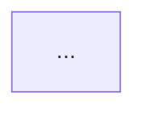

# Contrato: formato dos artefatos documentais (SPEC-018)

Esta feature não expõe uma API/CLI de aplicação — o "contrato" é o formato que cada
artefato documental MUST seguir, para que a auditoria de conformidade (SC-002/SC-003/SC-004)
seja verificável objetivamente, não por julgamento subjetivo (Princípio VIII).

## Contrato: `SKILL.md`

```markdown
# {Nome} Skill

{parágrafo intro: qual agente, qual spec, papel no enxame}

## Responsabilidade

{o que decide/faz; o que NÃO faz e por quê, com referência ao agente que faz aquilo}

## Ferramentas

| Ferramenta | Entrada | Saída | Uso pelo agente |
|---|---|---|---|
| ... | ... | ... | ... |

## Input

{de onde vêm os parâmetros/dependências}

## Output

{tipo de saída Pydantic, garantias de contrato}
```

**Pós-condição verificável**: `grep -l "^## Responsabilidade" skills/*/SKILL.md | wc -l`
retorna 7 (FR-005); as quatro seções (`Responsabilidade`, `Ferramentas`, `Input`, `Output`)
aparecem, nesta ordem, em todos os 7 arquivos.

## Contrato: diagrama Mermaid embutido no README

````markdown

````

**Pós-condição verificável**: cada bloco ` ```mermaid ` renderiza sem erro na visualização
do GitHub (SC-003) — verificável abrindo a página do README no GitHub após o push (não há
linter de sintaxe Mermaid automatizado neste projeto; validação visual manual é suficiente
dado o volume de 3 diagramas).

## Contrato: mapeamento dos 11 entregáveis no README

```markdown
| # | Entregável | Onde está |
|---|---|---|
| 1 | Código-fonte, agente Pydantic AI, modelos, MCP, API, Docker, guardrail | `src/`, `mcp_servers/`, `Dockerfile`, `docker-compose.yml` |
| 2 | Modelos Pydantic de exemplo | `src/pix_compliance/models.py`, `docs/schemas/` |
...
```

**Pós-condição verificável**: os 11 números (1 a 11) aparecem na tabela, cada um com pelo
menos um caminho de repositório referenciado (SC-002) — conferível por leitura direta, sem
ferramenta.

## Contrato: `docs/spec-methodology.md`

Documento único (não fragmentado), com as cinco seções listadas em `data-model.md`
("O que é SDD neste projeto", "Por que escopo negativo", "Papel do `constitution.md`",
"Papel do `CLAUDE.md`/Claude Code", "Desvios reais do Princípio IX") — a última seção MUST
citar as specs pelo número (SPEC-011, SPEC-017), não uma afirmação genérica sem exemplo.

## Cenário de verificação de ponta a ponta (User Story 1, SC-001)

```bash
git clone <repo-url> pix-compliance-swarm-verificacao
cd pix-compliance-swarm-verificacao
cp .env.example .env
# preencher .env conforme instruções do README
docker compose up -d
# aguardar todos os serviços saudáveis (docker compose ps)
curl -f http://localhost:8000/docs
```

**Pós-condição**: cada comando funciona exatamente como o README descreve, sem passo
omitido nem informação que só quem já trabalhou no projeto saberia inferir.
